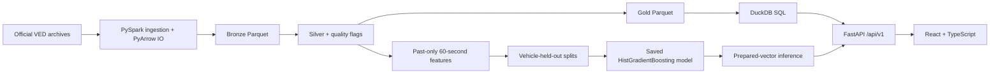
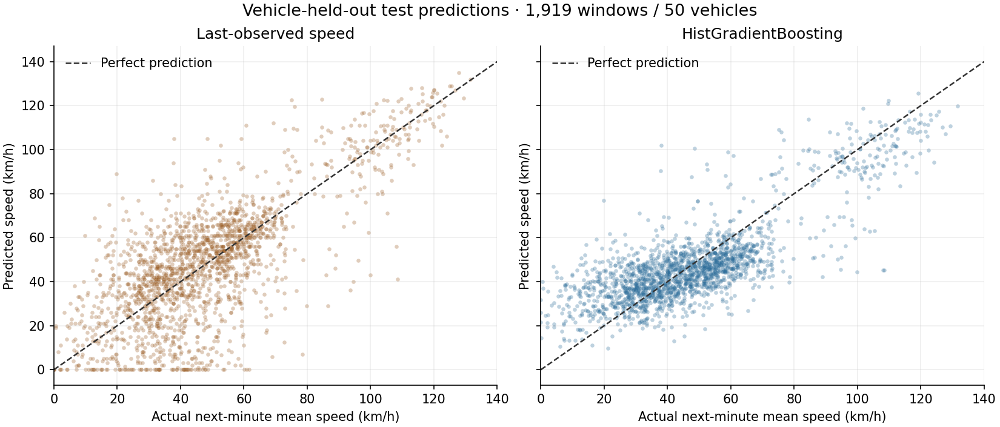

# FleetPulse

**Vehicle telemetry → auditable analytics → leakage-safe forecasting → FastAPI and React.**

FleetPulse is a full-stack Data Engineering + ML portfolio project using genuine vehicle telemetry. It investigates whether the previous minute of driving can predict mean speed over the next minute, and exposes fleet analytics, measurement quality and model evaluation through a local dashboard.

The project reconciles **22,436,808 observations**, **384 vehicles** and **32,552 trips**. It demonstrates a reproducible chain from source records to held-out vehicle evaluation, without claiming fleet-wide production readiness.

**Release status:** automated validation passes; desktop/mobile visual sign-off remains pending because available browser tools cannot open a browser. No dashboard screenshots or visual-verification claims are fabricated. Follow the [manual browser checklist](docs/demo_guide.md#manual-browser-sign-off).

## Architecture and stack



[Architecture and measurement boundaries](docs/architecture.md) explain quarantine, training/evaluation isolation and artifact dependencies.

| Component | Technology |
|---|---|
| Ingestion / cleaning | Python 3.12, PySpark 4.0.3, JDK 21, PyArrow 20.0.0 |
| Analytics | DuckDB 1.4.4, Parquet, reusable SQL |
| Features / ML | Pandas, NumPy, scikit-learn 1.7.2 HistGradientBoostingRegressor |
| Backend | FastAPI 0.115.12, Pydantic, Uvicorn |
| Frontend | React 19, TypeScript 5.9, Vite 7, Tailwind CSS 4, Recharts, Lucide |
| Validation | Pytest, Vitest, Testing Library, real-artifact API/DOM checks |

Exact dependencies are pinned in [requirements.txt](requirements.txt) and [package-lock.json](dashboard/package-lock.json). CPU execution is sufficient; the GPU is unused. No cloud infrastructure is required.

## Dataset and engineering

Source: [Vehicle Energy Dataset (VED), author-maintained repository](https://github.com/gsoh/VED), by Geunseob Oh, David LeBlanc and Huei Peng. The author describes Ann Arbor telemetry collected in 2017–2018 and supplies an [Apache-2.0 dataset license](https://github.com/gsoh/VED/blob/master/LICENSE). Acquisition pins commit `6baa4963782d515a67d32a5490bd5d11f5d9bf0d`; hashes, archive CRCs and storage checks are recorded locally.

The source README reports 383 vehicles; the actual 54 CSVs contain **384 distinct IDs**. FleetPulse reports inspected file statistics rather than copying the README population count. Trip-relative millisecond timestamps, irregular sampling and structural sensor missingness are explicit constraints. GPS exists in the source but is not used to invent live vehicle locations or forecasting features.

| Layer | Measured result and purpose |
|---|---|
| Bronze | 22,436,808 rows; original tokens, provenance and malformed-record indicators |
| Silver | 22,434,106 retained + 2,702 quarantined rows; typed measurements and quality flags |
| Gold | Fleet overview (1), vehicles (384), trips (32,552), daily cohorts (375), monthly cohorts (13), powertrains (4), quality metrics (5) |

Silver quarantines negative elapsed timestamps and preserves missingness without sensor imputation. SOC precision overshoot `(100,100.001]` becomes 100 with a flag and original value retained; other out-of-range SOC becomes unavailable. Legitimately signed current/temperature remain signed. See [Day 3 rules and feasibility](docs/day3_report.md).

Gold distance is a **partial observed-segment estimate** from speed integration over eligible gaps ≤2 seconds, not odometer or complete trip mileage. Daily/monthly summaries group whole trips by dataset-reference trip-start date; the source timezone is unspecified. [SQL examples](sql/README.md) expose these assumptions.

Fuel forecasting was rejected before training: **96.0061%** of Bronze fuel-rate readings are missing. The original ICE/HEV population supports only **one vehicle, one trip and one paired forecasting window** under the gap policy. Vehicle-held-out evaluation would be impossible. The approved target is speed; missing fuel and proxy consumption are never fabricated.

## ML methodology and results

At observed prediction time **t**, use `[t−60s,t]` to predict the time-weighted mean measured speed in `[t,t+60s]`, in km/h. Exact observed endpoints and gaps ≤2 seconds are required. The shared boundary at t is known at prediction time; all later telemetry belongs exclusively to the label.

- Silver reproduces 34,348 eligible candidates across 318 vehicles. Strict selection produces **11,549 examples** without reusing observations between complete 120-second contexts within a trip.
- **31 past-only features** describe speed, acceleration, stops, sampling and available sensor means/coverage. IDs, GPS, absolute dates, future coverage and whole-trip Gold statistics are excluded.
- Frozen deterministic vehicle splits contain **7,509 examples / 223 represented vehicles** in training, **2,121 / 45** in validation and **1,919 / 50** in test. No vehicle crosses splits.
- Six fixed configurations are compared on validation only. The final model remains training-only with native NaN handling, no imputation/scaling and no random-row early stopping. Test results do not select features or hyperparameters.

| Method | Validation MAE | Validation RMSE | Test MAE | Test RMSE |
|---|---:|---:|---:|---:|
| Last-observed speed | 13.702 | 18.220 | 14.056 | 18.803 |
| Past-mean persistence | 14.632 | 19.893 | 14.187 | 19.245 |
| Training historical mean | 17.391 | 24.349 | 17.815 | 23.724 |
| HistGradientBoosting | **10.438** | **13.678** | **10.887** | **14.091** |

Errors are **km/h**, evaluated on identical examples. Test pooled MAE improves **22.55%** and RMSE **25.06%** relative to last-observed speed. With 2,000 fixed-seed vehicle-cluster bootstrap replicates, test MAE's 95% interval is **10.188–11.905 km/h** and RMSE's is **13.194–15.304 km/h**.

Improvement is not universal: **16 of 50 test vehicles worsen**, low/high-speed cohorts worsen, and paired vehicle-macro MAE improvement's interval crosses zero. **EVs are absent from the test set.** These are conditional aggregate intervals, not individual-prediction intervals. [Day 6 evaluation](docs/day6_report.md) includes macro errors, cohort analysis and validation-only importance.



## Run locally on Windows

Use Python 3.12 and Node.js 24 for the validated environment. JDK 21 is needed for Spark/reconstruction and the complete fixture suite, **not** API/dashboard startup. [Fresh-machine instructions](docs/demo_guide.md#fresh-windows-setup) include official installer links and process-only Java configuration.

```powershell
git clone https://github.com/VViswaPrahlad/FleetPulse.git
Set-Location FleetPulse
py -3.12 -m venv .venv
.\.venv\Scripts\python.exe -m pip install -r requirements.txt
$env:npm_config_cache = Join-Path (Get-Location) 'data/tmp/npm-cache'
npm.cmd ci --prefix dashboard
```

With existing local artifacts, use **two PowerShell terminals** at the project root:

```powershell
# Terminal 1
.\scripts\run_backend.ps1
```

```powershell
# Terminal 2
.\scripts\run_frontend.ps1
```

Open `http://127.0.0.1:5173`; API documentation is `http://127.0.0.1:8000/docs`. The backend binds loopback, uses one worker and sets native CPU limits only in its terminal process. Do not bypass execution-policy/security restrictions if scripts are blocked.

**Git contains source, tests, SQL, documentation, lockfiles and lightweight figures.** It excludes VED archives, CSV/Parquet outputs, result manifests, environments and trained model binaries. A source-only checkout can build the frontend, serve API docs/health and test fixtures; real analytics/readiness/predictions require locally generated artifacts. Missing artifacts produce honest unavailable states, never demo metrics. See [ordered artifact reconstruction](docs/demo_guide.md#artifact-reconstruction-source-only-checkout).

## API and prediction contract

Versioned routes expose fleet/vehicle/trip analytics, bounded date cohorts, powertrains, quality, model/baseline metrics and vehicle errors. Tables default to 25 rows and cap requests at 100; the browser never receives millions of observations. [Endpoint contracts](docs/api_contract.md) document filters, units, errors and CORS.

`POST /api/v1/ml/predict` requires the **exact 31 prepared past-only features** with schema/unit metadata. Raw GPS or incomplete raw telemetry is insufficient. Optional sensor means may be null only with coherent coverage; unexpected fields and invalid sampling histories are rejected. Model hash, feature order and library versions are checked without retraining.

```powershell
$request = Get-Content docs/examples/day7_prediction_request.json -Raw
Invoke-RestMethod -Method Post -Uri http://127.0.0.1:8000/api/v1/ml/predict `
    -ContentType 'application/json' -Body $request
```

The saved Day 6 model predicts **36.61748855856695 km/h** for this anonymous measured vector. The API validates consistency but cannot independently prove the historical provenance of a caller's prepared features.

## Tests and verification

```powershell
# Substitute your actual JDK folder; settings apply only to this process.
.\scripts\run_day2.ps1 -JavaHome 'C:\path\to\jdk-21' -Script '-m' pytest `
    -q --basetemp=data/tmp/pytest-release
npm.cmd --prefix dashboard test
npm.cmd --prefix dashboard run typecheck
npm.cmd --prefix dashboard run build
```

The latest release run passes **144 Python tests** and **32 frontend tests**, strict TypeScript checks and a production build. Real-artifact integration reconciles 5,332 projected Gold fields, exercises all five compiled-page DOM flows and verifies saved-model inference and backend-unavailable behavior. DOM/CSS checks do not establish visual correctness. Four frontend saved-contract tests skip when their ignored local Day 8 contracts are absent in a fresh clone.

[Day 10 report](docs/day10_report.md) records measured startup/runtime/storage, preservation and repository audits. [Day 9 hardening](docs/day9_report.md) documents confirmed defects and performance limits. New release checks write only ignored `results/day10/`; prior outputs stay unchanged.

## Limitations and future improvements

VED is one historical regional cohort with irregular sampling, structural missingness and uncalibrated ECU readings. Strict continuity/exact endpoints introduce offline selection bias. There are 50 independent test vehicles, not 1,919 independent drivers, and no test EVs.

This is a local portfolio application without authentication, TLS, public deployment or operational SLAs. Vite development modules expose source filenames; keep development servers loopback-only. The production bundle and API are checked for paths and recognized secrets. Manual desktop/mobile visual sign-off is still required.

Future work could investigate external-region/vehicle validation, low/high-speed behavior, causal raw-telemetry preparation and deployment controls. None is implemented in this release.

For interviews: [3–5 minute demo and engineering decisions](docs/demo_guide.md), [questions and answers](docs/interview_qa.md), and [approved ML problem definition](docs/ml_problem_definition.md).
