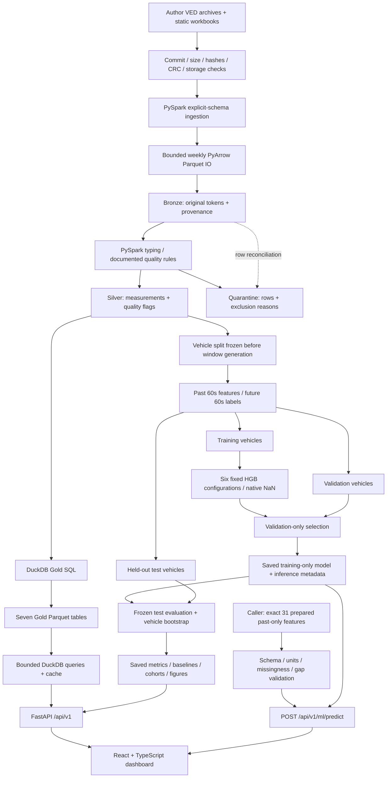

# FleetPulse architecture

Immutable measurements, descriptive analytics and causal forecasting are separate contracts. Everything runs locally on Windows; no cloud, queue, container or streaming infrastructure is needed.

## Artifact contracts

| Boundary | Local artifact | Contract |
|---|---|---|
| Source → Bronze | `data/raw/ved/`, `data/bronze/ved/` | Pinned author commit, inspected schema, raw tokens, malformed flags and provenance |
| Bronze → Silver | `data/silver/ved/`, `data/quarantine/ved/` | Every input retained or quarantined; stable row provenance; original SOC preserved |
| Silver → Gold | `data/gold/ved/` | Seven descriptive tables; source/SQL/output hashes; explicit NULL semantics |
| Silver → ML | `data/ml/speed/`, `results/day5/` | Exact endpoints, gaps ≤2s, strict disjoint contexts, frozen vehicle manifests and 31 features |
| Model / evaluation | `models/day6/`, `results/day6/` | Trusted local artifact, hash/version/feature order checks, immutable evaluation |
| Serving | Gold, Day 3/6 reports, saved model | No ETL at startup; bounded projections; safe unavailable/error responses |
| Browser | Typed `/api/v1` DTOs | Pagination/filters, cancellation, loading/empty/error states, no fabricated fallback telemetry |

Datasets/model binaries/reports remain ignored by Git; source, SQL, tests, lockfiles, contracts and lightweight evaluation figures are tracked. Paths resolve from the project root. A clone requires local artifact reconstruction before analytics/readiness/inference succeed. See [fresh Windows setup](demo_guide.md#fresh-windows-setup).

Weekly PyArrow IO avoids Windows Hadoop native-writer dependencies. Bronze/Silver use source-month directories and weekly files; compact Gold is not partitioned by vehicle ID. Acquisition stages one archive at a time and checks free space and caps. Current storage is below the preferred 5 GB; the maximum is 10 GB.

## Measurement semantics

Bronze 22,436,808 = Silver 22,434,106 + quarantine 2,702; 384 vehicles and 32,552 vehicle/trip pairs remain. Elapsed milliseconds are trip-relative, not Unix time. Gold daily/monthly cohorts assign whole trips to the author's reference trip-start dates without inventing a timezone or splitting midnight crossings.

Distance integrates eligible measured speed intervals, requiring finite nonnegative endpoints and positive gaps ≤2s. It is partial segment coverage, not full mileage. Whole-trip/lifetime Gold aggregates cannot be causal forecasting features.

Negative elapsed time is quarantined. Sensor-specific invalid values become null with flags; legitimately signed current/temperature stay signed. SOC `(100,100.001]` is precision-normalized to 100; other invalid SOC is null. Bronze and Silver source-SOC preserve original values. No sensor imputation occurs. [Day 3](day3_report.md) records every rule.

## ML isolation

Features at t use `[t−60s,t]`; labels integrate speed over `[t,t+60s]`. Exact endpoints and gaps ≤2s are required. Future continuity determines offline label eligibility only, never features. Selected full contexts share no observations within a trip, including endpoints between examples.

The 11,549 examples cover 318 vehicles. Train/validation/test have 7,509/2,121/1,919 rows and 223/45/50 represented vehicles with no shared IDs. Predictors exclude IDs, coordinates, absolute dates, future coverage and Gold summaries. Six optional sensor means retain native NaN alongside observed fractions.

HistGradientBoosting fits training only. Six fixed configurations use validation pooled MAE; no validation refit, test tuning or random-row early stopping occurs. Baselines share examples; historical mean fits training only. Validation permutation importance and paired vehicle bootstrap do not alter the chosen model/features. No EV appears in test; pooled gains do not imply a uniform vehicle advantage.

## API and frontend

Routes/services/schemas are modular. DuckDB uses bounded read-only queries and a 32-entry cache; report parsing has size limits and a four-signature cache. Lists cap at 100 rows/100,000 offset; request bodies at 64 KiB. SQL filters are parameterized. Error responses expose no paths or tracebacks.

Inference validates exact prepared schema, history, units and coherent missingness/sampling, preserves feature order and checks model hash/library compatibility. It neither prepares features from raw GPS nor proves caller provenance. Aggregate confidence intervals are not prediction intervals.

The backend binds loopback, one worker, concurrency limit 32. Its launcher sets native CPU limits before scientific-library import, only within its process. CORS permits two documented localhost development origins without credentials. There is no authentication or public deployment; CORS is not an authentication boundary.

React uses the Vite same-origin proxy, bounded requests, obsolete-request cancellation and explicit retries. Invalid filters pause queries. Development JSX reveals source filenames; production assets and API responses are scanned separately.

## Verification boundaries

Fixture suites test parsing, quality, leakage, vehicle isolation, model inference and API/frontend behavior. Real-artifact checks reconcile projected Gold fields, saved metrics and actual inference. SHA-256 snapshots protect raw/Bronze/Silver/quarantine/Gold/ML/model and prior result files. Release tests do not execute production ETL or retraining.

DOM flows and CSS structure checks cannot verify chart pixels or real desktop/mobile layout. Browser tools remain unavailable; [manual visual sign-off](demo_guide.md#manual-browser-sign-off) is pending. [Day 10](day10_report.md) records actual measurements and limitations.
