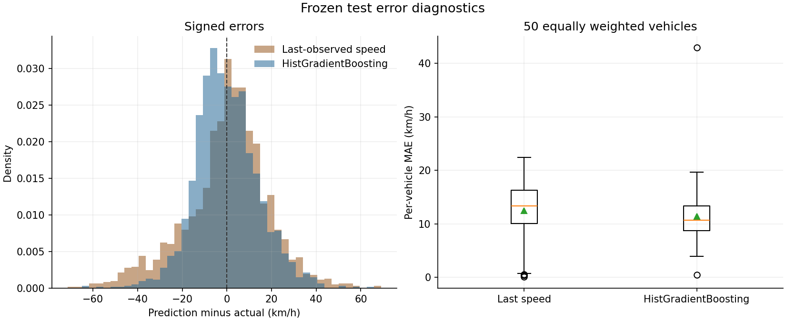
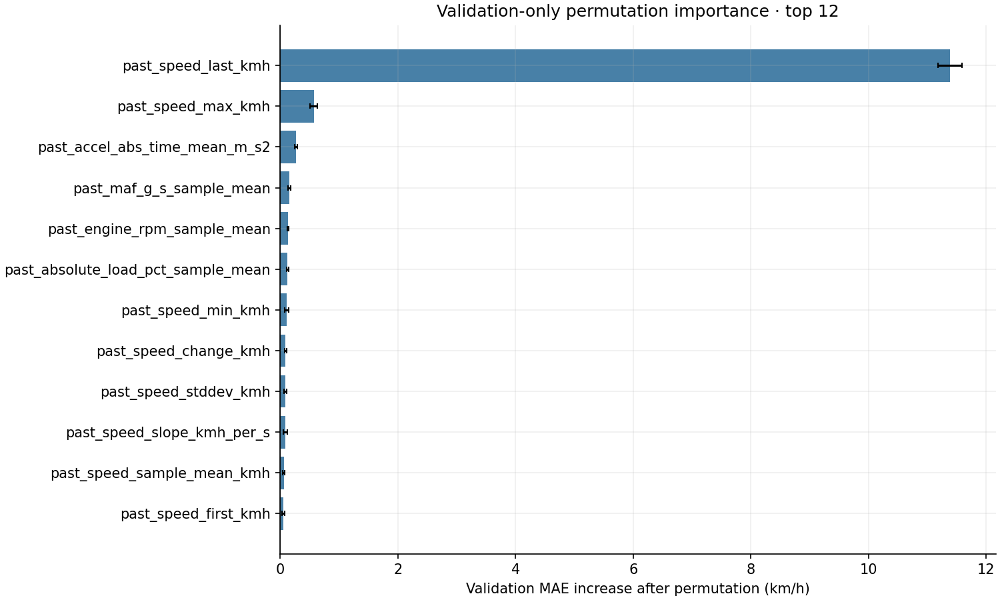

# FleetPulse Day 6 — CPU training and vehicle-held-out evaluation

Date: **2026-10-09**, Asia/Calcutta. **Day 6 completed and validated locally.**
The selected model improves pooled errors but not every vehicle/speed cohort.
Publication follows tests and the tracked-file audit; final commit/push status
is reported in chat and ignored local `results/day6/publication.json`.
No dashboard, cloud service, GPU training or Day 7 work occurred.

## Frozen inputs and leakage audit

Reuse exactly **11,549 examples and 31 features** from Day 5:

| Split | Examples | Independent vehicle clusters |
|---|---:|---:|
| Train | 7,509 | 223 |
| Validation | 2,121 | 45 |
| Test | 1,919 | 50 |

The saved schema, feature allowlist, target, per-split counts/labels, source
provenance hashes and vehicle assignment manifest are verified before fitting.
Combined rows/vehicles are 11,549/318. No vehicle occurs in multiple splits,
no retained trip contexts overlap or share source observations, and no duplicate
prediction anchors are present. The original exact 60-second endpoints and
<=2-second gaps remain unchanged; no Day 5 window is regenerated or excluded.

Predictor X contains exactly the ordered 31 **past-only** feature names, never
vehicle/trip IDs, engine type, split label, future values/coverage, absolute
timestamps, provenance or target. Feature matrix NaNs remain NaN. The regressor
learns its native missing-value routing on training data; no imputation, scaling
or feature-selection estimator is fitted on validation/test. Optional sensor
absence may still proxy powertrain/measurement availability; held-out IDs do not
eliminate that cohort limitation.

Bronze/Silver/Gold and every existing file in `data/ml/speed/` and
`results/day5/` are SHA-256 checked before/after, **unchanged**. Training/validation
audit can read test schema/labels for integrity; test values never enter model
fitting, model selection or permutation importance. Day 5 previously published
baseline test scores; Day 6 does not claim those labels have never been viewed.
Its model/hyperparameter choices use only training and validation data.

## Limited selection and final model

Estimator: scikit-learn **HistGradientBoostingRegressor**, CPU with threadpool
limit **1**, seed **20261009**, squared-error loss and native NaN handling.
Six configurations are fixed in source before any test model score. Select
lowest **pooled validation MAE**, breaking ties by candidate order. There is no
additional search prompted by test results. All candidates fit train only;
internal random-row early stopping is disabled. The final model is the already
fitted winning candidate, not a train+validation refit.

All candidates use 200 iterations. The inspected specifications/results are:

| Candidate | Learning rate | Max leaves | Min leaf samples | L2 | Validation MAE | Validation RMSE |
|---|---:|---:|---:|---:|---:|---:|
| 0 | 0.05 | 15 | 20 | 1.0 | 10.437937 | 13.677896 |
| 1 | 0.05 | 31 | 20 | 1.0 | 10.522612 | 13.751828 |
| 2 | 0.1 | 15 | 20 | 1.0 | 10.554722 | 13.819195 |
| 3 | 0.1 | 31 | 20 | 1.0 | 10.665075 | 13.983470 |
| 4 | 0.05 | 15 | 50 | 5.0 | 10.479717 | 13.686700 |
| 5 | 0.05 | 31 | 50 | 5.0 | 10.538073 | 13.774432 |

Winner: **candidate 0**, learning_rate=0.05,
max_iter=200, max_leaf_nodes=15,
min_samples_leaf=20, l2_regularization=1.0,
early_stopping=False, random_state=20261009, categorical_features=None.
No maximum depth constraint is added; remaining estimator defaults use the pinned
1.7.2 release (including max_bins=255). Continuous speed and sensor summaries
are numeric; IDs/powertrain are not predictive categorical columns.

The frozen selection is saved before any test prediction/errors, and the
comparison baseline is also chosen by validation pooled MAE. No target clipping,
prediction clipping, calibration, retraining or feature deletion follows test
inspection. Raw test model predictions range from
**9.682324 to 125.600062 km/h**;
negative predictions: **0**.

## Identical-example baseline comparison

The three existing rules are unchanged: last observed speed at t, past-minute
time-weighted speed, and a global training-label historical mean. Their scores
reconcile to Day 5 within 1e-10 km/h. The historical constant is not fitted on
validation/test. The strongest comparison baseline is **`last_observed_speed`**, selected
by validation pooled MAE before test evaluation. It is also best by pooled
test MAE among the three, but that fact does not determine the comparison.

Errors are km/h. Pooled metrics weight examples; macro metrics weight vehicles
equally. Macro RMSE is mean per-vehicle RMSE, not root mean of vehicle MSE.

| Split | Method | Pooled MAE | Pooled RMSE | Vehicle macro MAE | Vehicle macro RMSE |
|---|---|---:|---:|---:|---:|
| validation | `last_observed_speed` | 13.702132 | 18.219851 | 13.879786 | 17.201903 |
| validation | `past_mean_persistence` | 14.632047 | 19.892806 | 13.474043 | 17.213113 |
| validation | `training_historical_mean` | 17.390852 | 24.349012 | 17.018432 | 20.873840 |
| validation | `hist_gradient_boosting` | 10.437937 | 13.677896 | 10.485855 | 12.735026 |
| test | `last_observed_speed` | 14.056006 | 18.802985 | 12.466133 | 15.918880 |
| test | `past_mean_persistence` | 14.186875 | 19.245332 | 16.492761 | 19.991954 |
| test | `training_historical_mean` | 17.814939 | 23.724005 | 18.551034 | 22.457076 |
| test | `hist_gradient_boosting` | 10.886851 | 14.090555 | 11.382643 | 13.601596 |

Improvement = 100 * (baseline error - model error) / baseline error.
Negative values mean worse performance, not an absolute reduction.

| Split | Pooled MAE improvement | Pooled RMSE improvement |
|---|---:|---:|
| validation | 23.822532% | 24.928607% |
| test | 22.546625% | 25.062138% |

## Vehicle errors and fixed-seed confidence intervals

Use **2,000 paired whole-vehicle bootstrap replicates**, seed **20261009**,
95% percentile intervals. Validation draws 45 vehicles with replacement and
test draws 50; a drawn vehicle contributes all its windows, including repeated
draws. Model and baseline use identical draws. Pooled metrics retain each
vehicle's observed window count; macro metrics give each drawn vehicle equal
weight. Window-wise bootstrap would understate correlation and is not used.

Intervals are conditional on the chosen model, split and observed cohort.
They do not include uncertainty from retraining, hyperparameter selection,
multiple subgroup comparisons, different routes/drivers or fleet composition.
Vehicle is the cluster unit, not a claim of independent identified drivers.
Validation uncertainty is optimistic after selecting on validation scores;
test uncertainty is evaluated only after freezing the model.

| Quantity (km/h unless percentage) | Validation 95% interval | Test 95% interval |
|---|---:|---:|
| `model_mae_kmh` | 8.706939, 12.861801 | 10.187740, 11.904970 |
| `model_rmse_kmh` | 11.263668, 16.538379 | 13.193749, 15.304130 |
| `baseline_mae_kmh` | 12.182474, 15.846378 | 13.253292, 15.074851 |
| `baseline_rmse_kmh` | 16.144539, 20.880614 | 17.775802, 20.193593 |
| `paired_mae_reduction_kmh` | 2.541456, 3.817315 | 2.535612, 3.705248 |
| `paired_rmse_reduction_kmh` | 3.979990, 5.197505 | 4.149172, 5.250418 |
| `mae_improvement_pct` | 16.890588, 28.990972 | 18.164706, 25.860406 |
| `rmse_improvement_pct` | 19.851619, 30.956468 | 22.143653, 27.342672 |
| `model_vehicle_macro_mae_kmh` | 9.437252, 11.483849 | 9.948778, 13.131049 |
| `model_vehicle_macro_rmse_kmh` | 11.412571, 13.980859 | 11.999093, 15.425891 |
| `baseline_vehicle_macro_mae_kmh` | 12.323670, 15.416659 | 10.865596, 14.057703 |
| `baseline_vehicle_macro_rmse_kmh` | 15.245758, 19.022416 | 13.899324, 17.858098 |
| `paired_vehicle_macro_mae_reduction_kmh` | 1.813657, 5.058766 | -0.833267, 2.693245 |
| `paired_vehicle_macro_rmse_reduction_kmh` | 2.898606, 6.109704 | 0.305810, 4.055491 |

Pooled test MAE reduction and its interval are positive. However, the **paired
vehicle-macro MAE reduction interval crosses zero**, so an equal-weighted
average-vehicle advantage is not resolved at this confidence level.
Improvement is not universal:

| Split | Vehicles | Model lower MAE | Model higher MAE | Best model vehicle MAE | Worst model vehicle MAE |
|---|---:|---:|---:|---:|---:|
| validation | 45 | 37 | 8 | 0.261765 | 17.805337 |
| test | 50 | 34 | 16 | 0.421649 | 42.908206 |

Per-vehicle errors for model and all three baselines are saved locally in
`results/day6/vehicle_errors.parquet`; no individual traces/GPS are published.

## Speed-range and powertrain diagnostics

Bins use **actual future mean speed**, strictly for post-selection diagnostics,
never as a feature or selection criterion. Intervals are [0,20), [20,40),
[40,60), [60,80), [80,infinity) km/h. Vehicle counts can repeat between bins.
All methods retain exactly the same examples in each group. Subgroup metrics
are descriptive, not independently optimized models or multiplicity-adjusted claims.

| Split | Actual target range | Examples | Vehicles | Model MAE / RMSE | Last-speed MAE / RMSE | MAE improvement |
|---|---|---:|---:|---:|---:|---:|
| validation | [0,20) | 162 | 27 | 17.473170 / 20.569075 | 13.218312 / 18.629259 | -32.189% |
| validation | [20,40) | 505 | 40 | 9.821051 / 12.407815 | 16.141613 / 19.678162 | 39.157% |
| validation | [40,60) | 958 | 38 | 7.745744 / 10.536257 | 13.311997 / 17.670923 | 41.814% |
| validation | [60,80) | 261 | 30 | 14.179744 / 16.230972 | 12.320963 / 18.090394 | -15.086% |
| validation | [80,infinity) | 235 | 22 | 13.732959 / 17.913621 | 11.917777 / 16.980375 | -15.231% |
| test | [0,20) | 167 | 27 | 19.895838 / 22.349338 | 15.034362 / 19.860937 | -32.336% |
| test | [20,40) | 600 | 41 | 9.249682 / 12.056796 | 15.099550 / 18.690649 | 38.742% |
| test | [40,60) | 725 | 44 | 8.307926 / 10.619176 | 14.238405 / 19.148448 | 41.651% |
| test | [60,80) | 250 | 36 | 14.283396 / 16.496811 | 12.174845 / 18.504753 | -17.319% |
| test | [80,infinity) | 177 | 25 | 13.702581 / 18.499983 | 11.505374 / 17.066024 | -19.097% |

**Negative test results:** [0,20) (-32.34% MAE improvement, meaning degradation); [60,80) (-17.32% MAE improvement, meaning degradation); [80,infinity) (-19.10% MAE improvement, meaning degradation).
Regression toward central speeds hurts low and high-speed predictions. This
model is not modified after seeing those test failures. Prediction scatter
and vehicle outliers below show the tradeoff rather than only pooled averages.

| Split | Powertrain | Examples | Vehicles | Model MAE / RMSE | Last-speed MAE / RMSE | MAE improvement |
|---|---|---:|---:|---:|---:|---:|
| validation | EV | 71 | 1 | 8.812527 / 10.984434 | 12.638753 / 17.115040 | 30.274% |
| validation | HEV | 78 | 11 | 9.804792 / 12.745215 | 11.927821 / 16.051667 | 17.799% |
| validation | ICE | 1231 | 31 | 12.256172 / 15.824921 | 15.343905 / 20.180879 | 20.124% |
| validation | PHEV | 741 | 2 | 7.639749 / 9.529615 | 11.263366 / 14.779161 | 32.172% |
| test | HEV | 215 | 10 | 9.905181 / 12.371070 | 12.002159 / 15.836943 | 17.472% |
| test | ICE | 1211 | 34 | 11.456406 / 14.728968 | 14.968119 / 19.856896 | 23.461% |
| test | PHEV | 493 | 6 | 9.915914 / 13.160250 | 12.711195 / 17.270668 | 21.991% |

**EVs are absent from test.** Validation includes one EV vehicle, too small
for reliable EV generalization claims. ICE/HEV/PHEV test groups contain 34/10/6
vehicles; their uncertainty differs and none implies broader fleet coverage.
Powertrain is static author-workbook metadata used only for grouping diagnostics.

## Validation-only feature importance

Permutation importance uses the frozen model on validation only, five shuffles
per feature, seed 20261009, negative MAE scoring, one job. Values are increases
in validation MAE after permutation; standard deviation is across five shuffles,
not a 95% confidence interval. No test observation or error enters this step.
All 31 features remain in the final estimator. Correlated speed statistics can
share attribution; marginal permutation is not a causal effect and can produce
unrealistic sensor combinations. Small or negative values are not silently pruned.

| Feature (top 12) | Mean MAE increase km/h | Shuffle stddev km/h |
|---|---:|---:|
| `past_speed_last_kmh` | 11.384274 | 0.202787 |
| `past_speed_max_kmh` | 0.572553 | 0.062724 |
| `past_accel_abs_time_mean_m_s2` | 0.266075 | 0.020600 |
| `past_maf_g_s_sample_mean` | 0.152759 | 0.025336 |
| `past_engine_rpm_sample_mean` | 0.137204 | 0.011081 |
| `past_absolute_load_pct_sample_mean` | 0.125176 | 0.020363 |
| `past_speed_min_kmh` | 0.108840 | 0.031198 |
| `past_speed_change_kmh` | 0.092416 | 0.021857 |
| `past_speed_stddev_kmh` | 0.086491 | 0.019097 |
| `past_speed_slope_kmh_per_s` | 0.082631 | 0.034847 |
| `past_speed_sample_mean_kmh` | 0.059261 | 0.014043 |
| `past_speed_first_kmh` | 0.053522 | 0.020762 |

Last measured speed dominates, supporting the need to benchmark persistence.
Other speed/acceleration and engine measurements add less marginal information.

## Lightweight figures

All PNGs were visually inspected for readable labels and complete axes.
Combined size: **364,259 bytes**; largest:
**219,162 bytes**. They show only anonymized
speed/prediction/error summaries, no vehicle IDs, GPS, raw rows or sensor traces.






## Tests, reproducibility and local inference

**59 tests passed; 0 failed; 0 errors**.
This is 12 new Day 6 fixtures plus 47 relevant earlier feature, continuity and
Gold regressions. JUnit suite runtime: **13.872 seconds**.
Tests cover NaN prediction, predictor/metadata separation, strict inference
schema, reordered-column safety, seeded training, test/shared-vehicle rejection,
future metadata mutation, serialization/integrity, exact metrics, negative
improvements, whole-cluster paired resampling and absent-EV cohort reconciliation.

The actual 11,549-example dataset audit passes. All **4,040** validation/test
saved predictions match the loaded model exactly on the same IDs and labels;
all metric arithmetic reconciles. A fresh fit of only the frozen selected
specification on training data produces bit-identical validation predictions.
This is a reproducibility check, not another search or test-driven model choice.
The seeded full test bootstrap repeats exactly. Native NaNs are not filled.

The saved model occupies **171,778 bytes** under
`models/day6/hist_gradient_boosting.joblib`. Adjacent `inference_metadata.json`
records feature order, horizon/history/gap/units, source/fit-input/model hashes,
versions, seed, one CPU thread and selection policy. `load_model()` checks
model hash, feature contract and scikit-learn version; `predict_features()`
requires exactly the 31 predictive columns, retains NaNs, rejects infinities,
and safely reorders columns. Joblib loading is for trusted local artifacts;
hash checking detects corruption, not maliciously substituted model+metadata.

The test suite reports **73 Joblib/NumPy deprecation warnings** about array.shape
assignment in NumPy 2.5. These are not suppressed; all saved-model roundtrip
and prediction checks pass under the pinned environment. A future upgrade
should rerun compatibility tests. No existing NumPy dependency was upgraded.

| Package | Installed version |
|---|---|
| scikit-learn | 1.7.2 |
| numpy | 2.5.3 |
| scipy | 1.17.1 |
| pandas | 2.2.3 |
| pyarrow | 20.0.0 |
| joblib | 1.5.3 |
| threadpoolctl | 3.6.0 |
| matplotlib | 3.10.8 |

New CPU/plotting dependencies were installed only in project .venv using the
configured approval mechanism. Pip scratch and Matplotlib cache stay inside
the project. `pip check` passes. Supporting Matplotlib transitive versions are
reported by the installation log; the direct dependencies above are pinned.

Reference behavior: [scikit-learn 1.7 HistGradientBoostingRegressor](https://scikit-learn.org/1.7/modules/generated/sklearn.ensemble.HistGradientBoostingRegressor.html).

## Commands, artifacts and actual runtime

```powershell
.\.venv\Scripts\python.exe -m src.ml.train_speed
.\scripts\run_day2.ps1 -Script scripts/finalize_day6_statistics.py
.\scripts\run_day2.ps1 -Script scripts/validate_day6_actual.py
.\scripts\run_day2.ps1 -Script scripts/plot_day6.py
.\.venv\Scripts\python.exe -m pytest tests/test_day6_ml.py tests/test_day5_features.py tests/test_day3_feasibility.py tests/test_day4_gold.py -q --basetemp=data/tmp/pytest-day6
```

The optional launcher changes only process settings; this code does not run
Spark/Java or repeat Day 2 processing. Direct script execution needs project-root
PYTHONPATH. The fixed training script can regenerate the same model and numerical
results; timing and serialization bytes are not promised across different package
versions/platforms. No alternative test-tuned configuration is introduced.

Local ignored artifacts: model/metadata plus `results/day6/selection.json`,
`evaluation_policy.json`, `training_run.json`, `predictions.parquet`,
`vehicle_errors.parquet`, `cohort_metrics.json`, `permutation_importance.json`,
`independent_validation.json`, `figures.json`, and `day6_pytest.xml`.
Only implementation/tests/documentation and the three lightweight PNGs are staged.
No dataset, model binary, secrets, environment or large generated output is published.

- Audit + search + inference/evaluation + persistence runtime:
  **42.9157 seconds** (excluding package installation/plots/tests).
- Initial source/manifest audit: **13.1631 s**;
  six-candidate selection: **13.0389 s**;
  validation permutation importance: **14.7055 s**;
  frozen evaluation/bootstrap/cohorts: **0.2852 s**.
- Additional paired macro/bootstrap statistics: **0.0466 s**;
  independent actual-model/reproducibility checks: **6.4086 s**;
  figure rendering: **2.1238 s**.
- Logical complete project storage at validated pre-commit snapshot:
  **2,169,589,009 bytes (2.169589 GB decimal)**, including .venv, all
  preserved data, results, scratch and Git. This remains below preferred 5 GB
  and maximum 10 GB; file length is not NTFS allocated size.

The separate timings are actual stage executions, not a cumulative wall-clock
benchmark; some checks ran concurrently. Publication metadata records the final
post-commit storage and remote hash. All earlier outputs remain unchanged.

## Conclusion and remaining limitations

Positive pooled result: test MAE/RMSE are lower than persistence on the same
50 held-out vehicles, with positive paired pooled error-reduction intervals.
Negative/uncertain result: 16 test vehicles worsen, low/high-speed bins worsen,
and macro MAE superiority is not resolved by its cluster interval. The selected
model should not be described as better for every vehicle or powertrain.

The dataset's exact-endpoint/gap selection and structural sensor missingness
limit representativeness. Model and bootstrap results inherit ECU speed and
trapezoidal mean assumptions, correlated routes/trips and finite vehicle counts.
Validation selection and correlated feature permutation have stated caveats.
Published test diagnostics cannot be used to tune another Day 6 model; any
future selection must preserve a separately justified evaluation protocol.

**No unresolved Day 6 blocker. Stop after Day 6.** No dashboard or Day 7 work
started. Commit/push uses existing origin/main without rewriting history,
after the tracked-file audit and passing tests.
